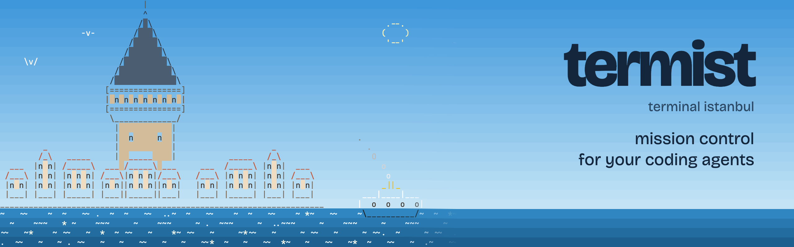
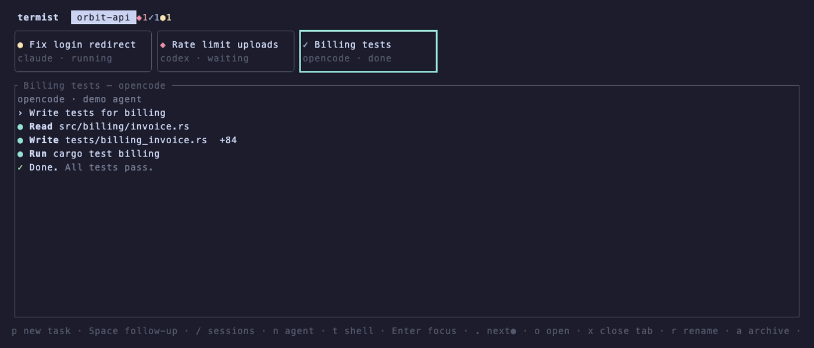
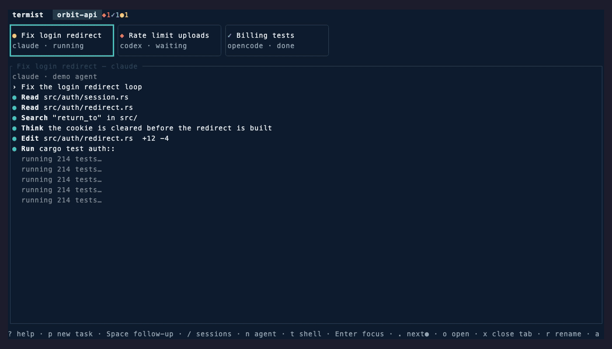
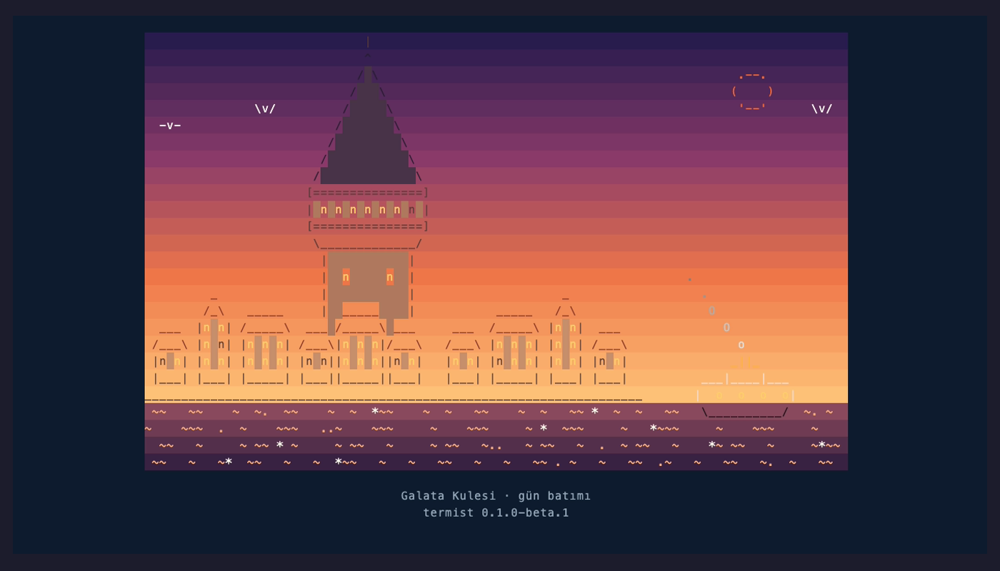
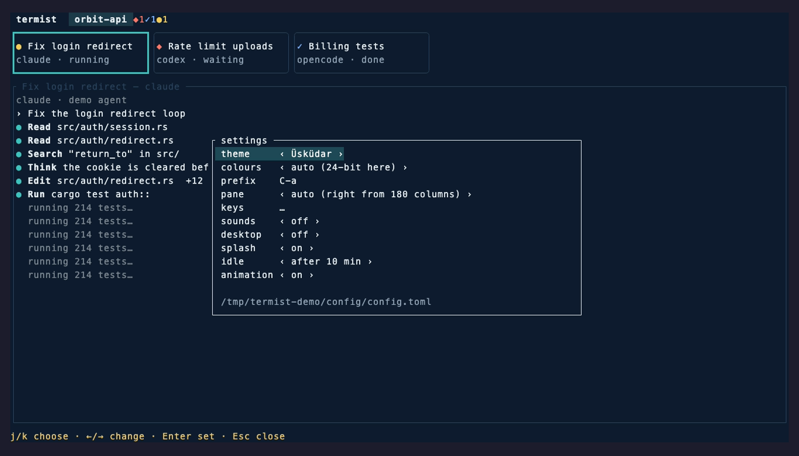
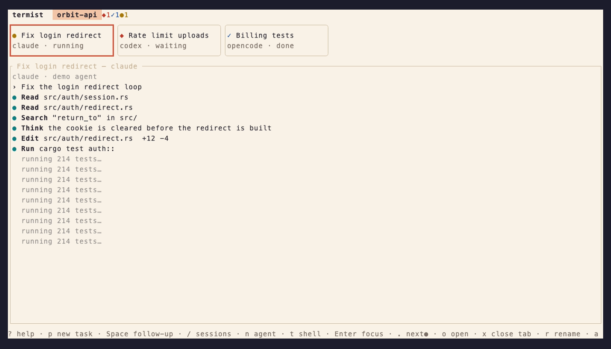
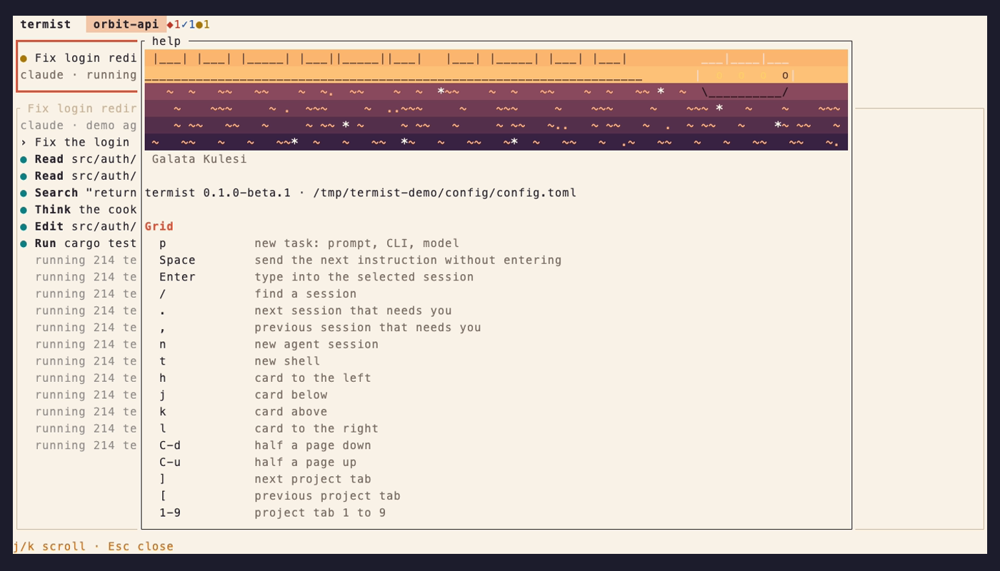

<div align="center">

<picture>
  <source media="(prefers-color-scheme: dark)" srcset="assets/readme/banner-dark.png">
  
</picture>

<h1>termist</h1>

<p><b>Run Claude Code, Codex and OpenCode side by side, across every project, from one terminal tab.</b></p>

<p>
  <a href="https://eyupucmaz.github.io/termist/"></a>
  <a href="#install"></a>
  <a href="CHANGELOG.md"></a>
</p>

<p>
  <a href="https://github.com/eyupucmaz/termist/releases"></a>
  <a href="https://github.com/eyupucmaz/termist/actions/workflows/ci.yml"></a>
  
  
  <a href="#license"></a>
</p>



</div>

> [!NOTE]
> **termist is in beta.** `v0.1.0-beta.1` adds themes, Istanbul scenes, sounds, notifications and
> settings to the first public build. It is used every day by its author, but expect rough edges, and
> please [tell us](https://github.com/eyupucmaz/termist/issues) what looks or feels wrong.

## Why termist

- **Agents outlive the window.** A small daemon owns every session. Close the TUI or the terminal and the
  agents keep working; `termist` attaches again.
- **One dot says it all.** Every session is a card with a status dot, driven by the agent's own hooks:
  running, waiting for you, or done.
- **Jump to the one that needs you.** `.` goes to the next agent waiting for an answer, across every
  project.
- **Start work without leaving the grid.** `p` opens a prompt: pick the agent, model and project, and
  it starts as a new card. `Space` sends a follow-up to a finished one.
- **Nothing lost on a reboot.** Sessions come back as `○ disconnected`; `Enter` resumes the same
  conversation.
- **Your repositories stay yours.** termist runs the agent CLIs you already have and never writes into
  your projects or your agents' own config.

## New in the beta



<table>
  <tr>
    <td width="50%" valign="top">
      <a href="docs/scene.png"></a>
      <p><b>Istanbul scenes.</b> Galata, Kız Kulesi, Ayasofya, the Bosphorus Bridge, a vapur and the
      Basilica Cistern, in the colours of the hour: at start, on an empty grid and when you have been
      away a while.</p>
    </td>
    <td width="50%" valign="top">
      <a href="docs/settings.png"></a>
      <p><b>Settings, from inside (<code>s</code>).</b> Theme, colours, prefix, where the pane goes, and
      every key. Changes apply at once and are saved to <code>config.toml</code>, keeping your
      comments.</p>
    </td>
  </tr>
  <tr>
    <td width="50%" valign="top">
      <a href="docs/moda.png"></a>
      <p><b>Themes.</b> Üsküdar (dark, the default), Moda (light), or your terminal's own colours.
      Agents are told the colours termist draws them with, so they pick a light look on Moda.</p>
    </td>
    <td width="50%" valign="top">
      <a href="docs/help.png"></a>
      <p><b>Help (<code>?</code>).</b> Every key as it is bound now. Keys of the grid and of focus mode
      can be rebound.</p>
    </td>
  </tr>
</table>

Also new: sounds and desktop notifications when an agent waits for you or is done (Ghostty, WezTerm,
kitty, iTerm2 and others, through tmux too), the pane to the right of the cards from 180 columns, and
`termist update`. The [changelog](CHANGELOG.md) has everything.

## Install

**macOS and Linux**

```sh
curl -LsSf https://eyupucmaz.github.io/termist/install.sh | sh
```

**Windows** (PowerShell)

```powershell
powershell -ExecutionPolicy Bypass -c "irm https://eyupucmaz.github.io/termist/install.ps1 | iex"
```

Then open a terminal in a project and run `termist`. The daemon starts on its own, and the folder
becomes a project tab.

termist runs the agent CLIs you already have: install at least one of
[Claude Code](https://docs.anthropic.com/en/docs/claude-code), [Codex](https://github.com/openai/codex) or
[OpenCode](https://opencode.ai).

<details>
<summary><b>Other ways to install, and updating</b></summary>

<br>

Both installers put `termist` in `~/.cargo/bin`. Prebuilt archives for every platform are on the
[releases page](https://github.com/eyupucmaz/termist/releases). From source:
`cargo install --git https://github.com/eyupucmaz/termist termist`.

`termist update` installs the newest release where the installer put termist
(`termist update --check` only says whether there is one). Versions without it (0.1.0-alpha.1)
update by running the install line above again. Either way the daemon keeps running the old version,
with your sessions: when they can stop, run `termist kill`, then `termist` starts the new one.

</details>

## Use

| Key | Does |
|---|---|
| `p` | new task: type a prompt; `Tab` picks the agent, `^O` model and effort, `^P` project |
| `Enter` | type into the selected card (`Ctrl+a Esc` back to the grid) |
| `Space` | send a follow-up to a card without entering it |
| `.` / `,` | next / previous session that needs you, across all projects |
| `/` | find any session |
| `s` / `?` | settings / every key as it is bound now |
| `q` | quit the TUI; the agents keep running |

<details>
<summary><b>All keys</b></summary>

<br>

| Key | Does |
|---|---|
| `p` | new task: type a prompt; `Tab` picks the agent, `^O` model and effort, `^P` project |
| `n` / `t` | new agent session / new shell |
| `Enter` | type into the selected card (`Ctrl+a Esc` back to the grid) |
| `Space` | send a follow-up to a card without entering it |
| `.` / `,` | next / previous session that needs you, across all projects |
| `/` | find any session |
| `o` / `x` | open a project / close its tab (sessions keep running) |
| `r` / `a` / `A` | rename / archive / show archived |
| `d` | stop a session (asks first) |
| `s` | settings: theme, colours, prefix, pane, keys |
| `?` | help: every key as it is bound now |
| `q` | quit the TUI; the agents keep running |

`termist kill` stops the daemon and every session.

</details>

<details>
<summary><b>Status dots</b></summary>

<br>

| | |
|---|---|
| `●` yellow | running |
| `◆` red | waiting for you (a permission or a question) |
| `✓` blue | done, not seen yet |
| `●` green | done, seen |
| `✗` magenta | exited with an error |
| `○` grey | not running; `Enter` resumes it |

Status comes from each agent's own hooks, passed on the command line or through termist's own config
directory, never through files in your project.

</details>

## Contributing

Issues and pull requests are welcome. Please read the [code of conduct](CODE_OF_CONDUCT.md) first.

The demos are recorded with stand-in agents: `vhs assets/demo/demo.tape` after
`cargo build --release -p termist`, and `vhs assets/demo/look.tape` for the themes, settings and help.
The banner is drawn from the Galata scene by `python3 tools/build-banner.py`.

## License

Licensed under either of [Apache License, Version 2.0](LICENSE-APACHE) or [MIT license](LICENSE-MIT) at
your option.

<div align="center">
<sub>Written in Rust for macOS, Linux and Windows, in Istanbul.</sub>
</div>
